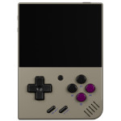
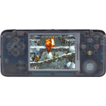
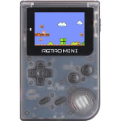
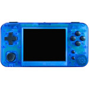
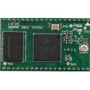
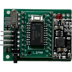
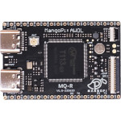
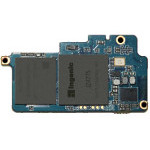

## My Cloud Storage
This repository contains all of files or resources used on my website. These files are put in the release page and the label is the device name, for example: miyoo. All of lists can be found in the following links.

&nbsp;

| Device | Resource Link |
| ------ | ------------- |
|   | [Gaviar](https://github.com/steward-fu/archives/releases/tag/f133) |
|   | [Miyoo](https://github.com/steward-fu/archives/releases/tag/miyoo) |
|   | [Pocket Go](https://github.com/steward-fu/archives/releases/tag/pocketgo) |
|   | [Miyoo Mini](https://github.com/steward-fu/archives/releases/tag/miyoo-mini) |
|   | [Miyoo Mini Plus](https://github.com/steward-fu/archives/releases/tag/miyoo-mini-plus) |
|   | [GP2X Wiz](https://github.com/steward-fu/archives/releases/tag/wiz) |
|   | [GP2X Caanoo](https://github.com/steward-fu/archives/releases/tag/caanoo) |
|   | [OpenPandora](https://github.com/steward-fu/archives/releases/tag/openpandora) |
|   | [Pyra](https://github.com/steward-fu/archives/releases/tag/pyra) |
|   | [PSP Go](https://github.com/steward-fu/archives/releases/tag/pspgo) |
|   | [PlayStation Vita](https://github.com/steward-fu/archives/releases/tag/psv) |
|   | [Game Boy](https://github.com/steward-fu/archives/releases/tag/gb) |
|   | [Game Boy Advance](https://github.com/steward-fu/archives/releases/tag/gba) |
|   | [Nintendo DS](https://github.com/steward-fu/archives/releases/tag/nds) |
|   | [Nintendo 3DS](https://github.com/steward-fu/archives/releases/tag/3ds) |
|   | [Game & Watch: Super Mario Bros.](https://github.com/steward-fu/archives/releases/tag/gw) |
|   | [Dingoo A320](https://github.com/steward-fu/archives/releases/tag/a320) |
|   | [Dingoo Tech A330](https://github.com/steward-fu/archives/releases/tag/a330) |
|   | [Dingoo Tech A380](https://github.com/steward-fu/archives/releases/tag/a380) |
|   | [Gemei A330](https://github.com/steward-fu/archives/releases/tag/ga330) |
|   | [Gemei X760+](https://github.com/steward-fu/archives/releases/tag/x760p) |
|   | [Ritmix RZX-50](https://github.com/steward-fu/archives/releases/tag/rzx50) |
|   | [Game Gear Micro](https://github.com/steward-fu/archives/releases/tag/ggm) |
|   | [TRIMUI](https://github.com/steward-fu/archives/releases/tag/trimui) |
|   | [TRIMUI SMART](https://github.com/steward-fu/archives/releases/tag/trimui-smart) |
|   | [GCW Zero](https://github.com/steward-fu/archives/releases/tag/gcw0) |
|   | [RS97](https://github.com/steward-fu/archives/releases/tag/rs97) |
|   | [RS90](https://github.com/steward-fu/archives/releases/tag/rs90) |
|   | [RG350](https://github.com/steward-fu/archives/releases/tag/rg350) |
|   | [RG99](https://github.com/steward-fu/archives/releases/tag/rg99) |
|   | [RG280M](https://github.com/steward-fu/archives/releases/tag/rg280m) |
|   | [RG300X](https://github.com/steward-fu/archives/releases/tag/rg300x) |
|   | [GKD350H](https://github.com/steward-fu/archives/releases/tag/gkd350h) |
|   | [GKDmini](https://github.com/steward-fu/archives/releases/tag/gkdmini) |
|   | [Z-Pocket Game Pro(ZPG Pro)](https://github.com/steward-fu/archives/releases/tag/zpg-pro) |
|   | [Powkiddy X3](https://github.com/steward-fu/archives/releases/tag/x3) |
|   | [X350](https://github.com/steward-fu/archives/releases/tag/x350) |
|   | [GPD Win](https://github.com/steward-fu/archives/releases/tag/gpdwin) |
|   | [GPD Win2](https://github.com/steward-fu/archives/releases/tag/gpdwin2) |
|   | [GPD XD](https://github.com/steward-fu/archives/releases/tag/gpdxd) |
|   | [Q8](https://github.com/steward-fu/archives/releases/tag/q8) |
|   | [Q90](https://github.com/steward-fu/archives/releases/tag/q90) |
|   | [FC3000](https://github.com/steward-fu/archives/releases/tag/fc3000) |
|   | [Retro CM3](https://github.com/steward-fu/archives/releases/tag/retro-cm3) |
|   | [PMP2](https://github.com/steward-fu/archives/releases/tag/pmp-v) |
|   | [Nokia N900](https://github.com/steward-fu/archives/releases/tag/n900) |
|   | [Nokia N810](https://github.com/steward-fu/archives/releases/tag/n810) |
|   | [Motorola XT897](https://github.com/steward-fu/archives/releases/tag/xt897) |
|   | [Gemini PDA 4G](https://github.com/steward-fu/archives/releases/tag/gemini-pda) |
|   | [Cosmo Communicator](https://github.com/steward-fu/archives/releases/tag/cosmo) |
|   | [Astro Slide 5G](https://github.com/steward-fu/archives/releases/tag/astro-slide-5g) |
|   | [Blackberry Passport](https://github.com/steward-fu/archives/releases/tag/q30) |
|   | [Sony Xperia X Compact](https://github.com/steward-fu/archives/releases/tag/f5321) |
|   | [PINE64 PinePhone](https://github.com/steward-fu/archives/releases/tag/pinephone) |
|   | [Google Pixel 3a XL](https://github.com/steward-fu/archives/releases/tag/pixel-3a-xl) |
|   | [F(x)tec Pro1](https://github.com/steward-fu/archives/releases/tag/pro1) |
|   | [F(x)tec Pro1 X](https://github.com/steward-fu/archives/releases/tag/pro1-x) |
|   | [Unihertz Titan](https://github.com/steward-fu/archives/releases/tag/titan) |
|   | [SHARP Zaurus](https://github.com/steward-fu/archives/releases/tag/zaurus) |
|   | [iriver Dicple D8](https://github.com/steward-fu/archives/releases/tag/d8) |
|   | [iriver Dicple D88](https://github.com/steward-fu/archives/releases/tag/d88) |
|   | [Zipit Z1](https://github.com/steward-fu/archives/releases/tag/zipit-z1) |
|   | [Zipit Z2](https://github.com/steward-fu/archives/releases/tag/zipit-z2) |
|   | [Zipit Z3](https://github.com/steward-fu/archives/releases/tag/zipit-z3) |
|   | [Ben Nanonote](https://github.com/steward-fu/archives/releases/tag/nanonote) |
|   | [Netwalker PC-T1](https://github.com/steward-fu/archives/releases/tag/pc-t1) |
|   | [Netwalker PC-Z1](https://github.com/steward-fu/archives/releases/tag/pc-z1) |
|   | [ASUS C100P](https://github.com/steward-fu/archives/releases/tag/c100p) |
|   | [Keyboard FeatherWing](https://github.com/steward-fu/archives/releases/tag/featherwing) |
|   | [Pocket C.H.I.P.](https://github.com/steward-fu/archives/releases/tag/pocketchip) |
|   | [SHARP Brain](https://github.com/steward-fu/archives/releases/tag/sharp-brain) |
|   | [GPD Micro](https://github.com/steward-fu/archives/releases/tag/gpdmicro) |
|   | [Orange Pi 2G-IoT](https://github.com/steward-fu/archives/releases/tag/2g-iot) |
|   | [Intel Quark D2000](https://github.com/steward-fu/archives/releases/tag/d2000) |
|   | [AM3354](https://github.com/steward-fu/archives/releases/tag/cm3354h) |
|   | [Sipeed Longan Nano](https://github.com/steward-fu/archives/releases/tag/gd32vf103) |
|   | [JS9331](https://github.com/steward-fu/archives/releases/tag/js9331) |
|   | [Lichee Nano](https://github.com/steward-fu/archives/releases/tag/lichee-nano) |
|   | [Sipeed M1s Dock](https://github.com/steward-fu/archives/releases/tag/m1s-dock) |
|   | [Sipeed Maix Bit](https://github.com/steward-fu/archives/releases/tag/maix-bit) |
|   | [MC68HC908JB8](https://github.com/steward-fu/archives/releases/tag/mc68hc908jb8) |
|   | [PocketBeagle](https://github.com/steward-fu/archives/releases/tag/pocketbeagle) |
|   | [Raspberry Pi](https://github.com/steward-fu/archives/releases/tag/raspberrypi-1) |
|   | [Allwinner T113-S3](https://github.com/steward-fu/archives/releases/tag/t113-s3) |
|   | [Tiny200](https://github.com/steward-fu/archives/releases/tag/tiny200) |
|   | [MT7688](https://github.com/steward-fu/archives/releases/tag/mt7688) |
|   | [MT7688 Duo](https://github.com/steward-fu/archives/releases/tag/mt7688-duo) |
|   | [Newton](https://github.com/steward-fu/archives/releases/tag/newton) |
|   | [NUC972](https://github.com/steward-fu/archives/releases/tag/nuc972) |
|   | [NUC977](https://github.com/steward-fu/archives/releases/tag/nuc977) |
|   | [Virus](https://github.com/steward-fu/archives/releases/tag/hack) |
|   | [NeoGeo](https://github.com/steward-fu/archives/releases/tag/neogeo) |
